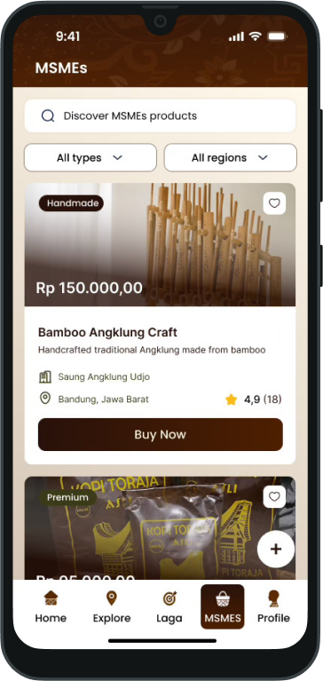
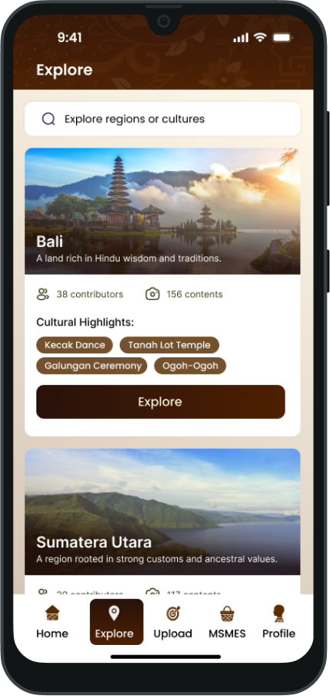
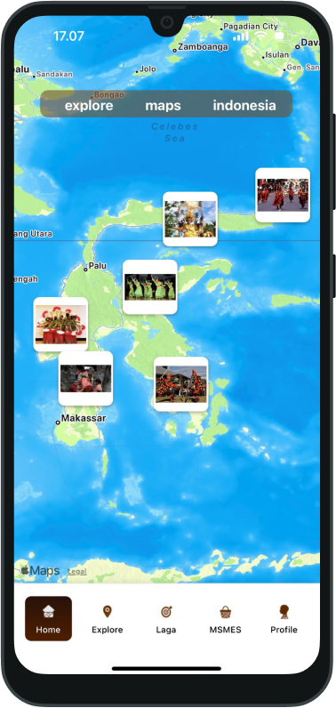

# Welcome to JejakNusa

## Overview

**JejakNusa** is a map-based digital platform offering a virtual, collaborative, and educational cultural experience. Users can explore the Archipelago’s heritage without geographic barriers, while also engaging with cultural MSMEs. It combines learning and play through cultural quizzes, challenges, and more.

## Main features

### **Interactive Cultural Map**

Displays location-based content with 3D views for popular sites.

### **Post & Translatep**

A feature for uploading cultural content (photos or short videos) with AI-based automatic translations.

### **Cultural Exploration**

A cultural directory by region: language, traditions, cuisine, and arts.

### **Gamified Leaning**

“Word of the Day,” quizzes, and cultural challenges to enhance literacy.

### **Cultural MSMEs Showcase**

A curated catalog of local cultural products connected with a global audience.

### **Profile & Achievements**

A badge and progress system to encourage active participation.

## Tech Stack

<div align="center">
  <table>
    <tr>
      <th>Layer</th>
      <th>Technology</th>
      <th>Purpose</th>
    </tr>
    <tr>
      <td align="center">
        
      </td>
      <td><strong>React Native</strong><br>NativeWind</td>
      <td>A cross-platform mobile-first approach for Android and iOS, enabling rapid development</td>
    </tr>
    <tr>
      <td align="center">
        
      </td>
      <td><strong>Hono</strong><br>Drizzle ORM</td> 
      <td>A minimalist and high-performance backend stack</td>
    </tr>
    <tr>
      <td align="center">
        
      </td>
      <td><strong>PostgreSQL</strong>
      <td>Data storage dan caching untuk performa optimal</td>
    </tr>
    <tr>
      <td align="center">
        
      </td>
      <td><strong>FastAPI</strong><br>GeminiAI</td>
      <td>Machine learning dan AI processing</td>
    </tr>
  </table>
</div>

## Screenshots

<div align="center">
  <table>
    <tr>
      <td align="center">
        
        <br><b>MSMES</b>
      </td>
      <td align="center">
        
        <br><b>Explore</b>
      </td>
      <td align="center">
        
        <br><b>Peta</b>
      </td>
    </tr>
  </table>
</div>

## How to Run

**Frontend:**

1. Clone the Frontend Repository:

```bash
git clone https://github.com/carllix/JejakNusa-Frontend.git
```

2. Navigate to the frontend directory:

```bash
cd JejakNusa-Frontend
```

3. Install dependencies

   ```bash
   npm install
   ```

4. Start the frontend

   ```bash
   npx expo start
   ```

In the output, you'll find options to open the app in a

- [development build](https://docs.expo.dev/develop/development-builds/introduction/)
- [Android emulator](https://docs.expo.dev/workflow/android-studio-emulator/)
- [iOS simulator](https://docs.expo.dev/workflow/ios-simulator/)
- [Expo Go](https://expo.dev/go), a limited sandbox for trying out app development with Expo

**Backend**

1.  Clone the backend repository

```bash
git clone https://github.com/carllix/JejakNusa-Backend.git
```

2. Navigate to the Backend directory:

```bash
cd JejakNusa-Backend
```

3. Install the dependendencies

```bash
bun install
```

4. Start the backend

```bash
bun run dev
```

## Links

<div align="left">

**Demo**: [Try our demo]()

</div>

## Author

| **Nama Anggota**      | **Github**                              |
| --------------------- | --------------------------------------- |
| Dzaky Aurelia Fawwaz  | [WwzFwz](https://github.com/WwzFwz)     |
| Carlo Angkisan        | [carllix](https://github.com/carllix)   |
| Alfian Hanif Yustanto | [barruadi](https://github.com/barruadi) |
| Adinda Putri          | [adndax](https://github.com/adndax)     |
